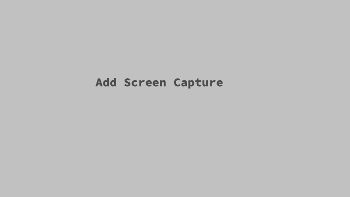

## d_ocean_api
A basic Django API learning project.

## Motivation
A short description of the motivation behind the creation and maintenance of the project. This should explain **why** the project exists.

## Build status
Build status of continus integration i.e. travis, appveyor etc. Ex. -

## Code style
- [Pep8](https://pep8.org/)

## Tech/framework used
<b>Built with</b>
- [Python 3.7.5](https://www.python.org)
- [Django 2.2.8](https://www.djangoproject.com/)
- [Cookiecutter Django](https://github.com/pydanny/cookiecutter-django)

## Development Setup
Provide step by step series of examples and explanations about how to get a development env running.

## API Reference
Pending

## Tests
Pending

## Contribute
Not Applicable

## Credits
This project is based upon Digital Ocean's [How To Display Data from the DigitalOcean API with Django](https://www.digitalocean.com/community/tutorials/how-to-display-data-from-the-digitalocean-api-with-django), Cookiecutter Django, and [WS Vincent's DjangoX](https://github.com/wsvincent/djangox)

## Meta
Derrick Kearney – [@diek007](https://twitter.com/diek007) – d_kearney@bellaliant.net

[https://github.com/diek/d_ocean_api](https://github.com/diek/d_ocean_api)
## License
A short snippet describing the license (MIT, Apache etc)

MIT © [Derrick Kearney]()
